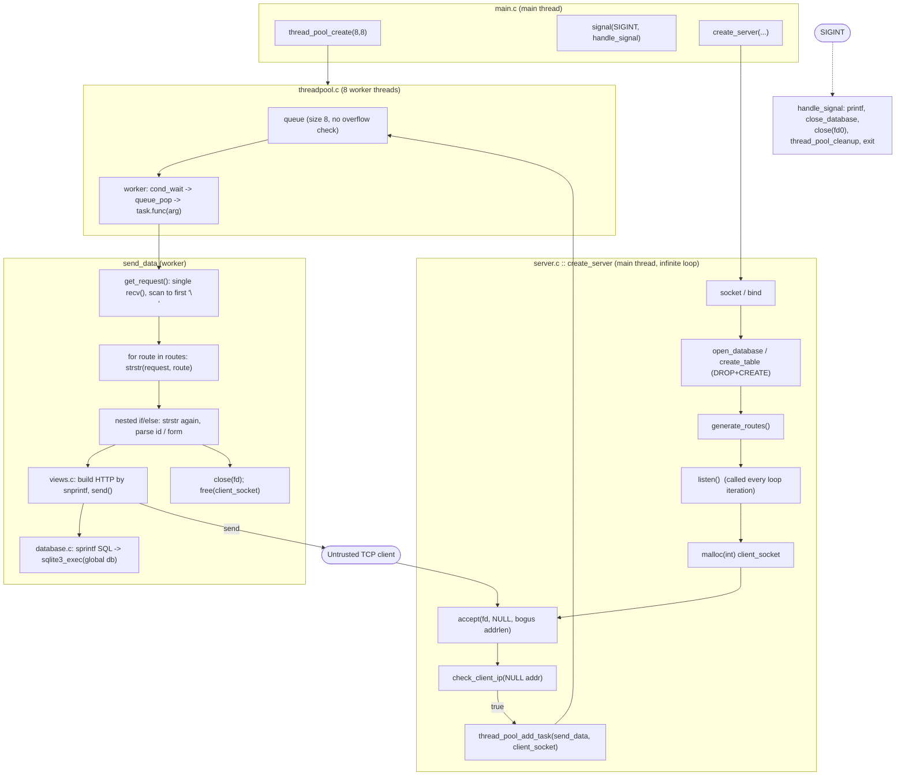

# ultra-minimal-fast-rest-api Audit

> Adversarial security / networking / concurrency / correctness / architecture review.
> Scope: entire repository at time of audit. **No code was modified.**
> Evidence includes source inspection plus a real compile under `-Wall -Wextra -Wpedantic` (GCC).

---

## 1. Executive Summary

The uncomfortable truth, up front:

- **Is this server safe to expose to untrusted clients?** **No. Absolutely not.** A single unauthenticated TCP packet with no `\n` in it overflows a stack buffer (`get_request`). A path with no `H` byte overflows another (`id[256]`). Form values flow unescaped into `sprintf`-built SQL (**injection**) and unescaped into hand-built JSON (**broken output**). The IP allowlist does not actually inspect the client's IP — it reads a stack pointer's bytes, which happen to decode to `0.0.0.0`, which is on the allowlist, so **everyone is allowed**. Any of several requests will `exit()` the whole process. This is a remote-crash / remote-SQL-injection / remote-memory-corruption surface.
- **Is it acceptable as a localhost mock server?** **Only barely, and only for the exact happy-path requests the Python tests send.** It will serve `GET /users`, `POST /users`, etc. from `localhost` for a demo. The moment a real browser, a fuzzer, a proxy, or two concurrent writers show up, behavior degrades from "wrong" to "crashed."
- **Does it actually implement HTTP robustly?** No. This is not an HTTP parser; it is `strstr()` in a trenchcoat. It assumes one `recv()` == one complete request, uses `\n` instead of `\r\n`, ignores `Content-Length`, finds the body by searching for a header string, and routes by substring-matching the raw request buffer (headers and body included).
- **Is the thread-pool model salvageable?** The *shape* is fine (fixed workers + bounded queue + condvar). The *implementation* has an uninitialized `active_tasks`, a queue with no capacity enforcement (silently overwrites pending work), and a two-mutex design where the wait predicate (`queue.count`) is read under one lock and mutated under another. It is salvageable but every synchronization detail needs rewriting.
- **Is the database architecture salvageable?** The concept (one SQLite file, generated schema) is fine for a mock. The implementation drops and recreates the table on **every startup** (a persistence API that deletes its own data), shares `sqlite3*` + `rc` + `db_err_msg` as globals across 8 threads, and builds SQL by string concatenation. Salvageable, but the destructive init and the injection must go.
- **Incrementally repair, or redesign?** The transport + parsing + routing core cannot be incrementally patched into correctness — the bugs are not lines, they are the absence of a request-framing model. See the final decision: **C — Rebuild the server core**, keep the model/codegen idea and the overall project shape.

Overall grade: an ambitious learning project with genuinely good instincts (thread pool, codegen-from-model, allowlist, structured views) wired on top of a request-processing core that is unsound against anything but its own test script.

---

## 2. Current Architecture



### Request path (as actually implemented)

```
client -> TCP -> accept() [addr never captured]
       -> malloc(int fd) -> thread_pool queue (may be overwritten)
       -> worker -> single recv() [assumed complete]
       -> scan to first '\n' into request[] [no bound]
       -> strstr() route match over the whole raw buffer
       -> ad-hoc id/form parsing [no bounds, stops on 'H']
       -> view -> sprintf SQL -> sqlite3_exec(global db, global rc, global err)
       -> callback concatenates JSON with sprintf [no escaping/bounds]
       -> snprintf HTTP response (\n line endings) -> send() -> close()
```

### Global mutable state (the important part)

| Global | File | Shared by | Problem |
| --- | --- | --- | --- |
| `int server_socket` | main.c:5 | main + handler | **Never assigned** the real fd (passed by value into `create_server`); handler closes fd 0 |
| `thread_pool_t *pool` | main.c:6 | main + handler | Cleaned up from async signal handler |
| `char *routes[]`, `url_*[]` | server.c:8-15 | all 8 workers (read-only after init) | OK once generated; init races if a request arrives mid-`generate_routes` (it can't here, but the pattern is fragile) |
| `sqlite3 *db` | database.c:5 | all 8 workers | One connection, concurrent `sqlite3_exec` |
| `int rc` | database.c:6 | all 8 workers | **Data race** on every query's status |
| `char *db_err_msg` | database.c:7 | all 8 workers | **Data race** on error pointer; also initialized as `(char)0` |

---

## 3. Threat Model

**Attacker A — malformed remote client (unauthenticated).** Can send arbitrary bytes. **This is the dominant threat and the server loses to it comprehensively:** no-`\n` request overflows `request[]`; no-`H` path overflows `id[]`; missing form value dereferences NULL (`strtok` returns NULL into `strcpy`); `recv` error `exit()`s the whole server; oversized bodies/rows overflow fixed buffers.

**Attacker B — concurrent clients.** `rc` and `db_err_msg` are raced by all workers; the queue silently overwrites pending connections above depth 8 (leaking fds and losing clients); the worker wait-predicate is read under the wrong mutex. SQLite itself is likely safe (serialized mode) but the surrounding globals are not.

**Attacker C — database contents.** Any stored value containing `"`, `\`, newline, or control chars produces **invalid JSON**. A NULL in an INT/REAL column emits bare `NULL` (invalid JSON token). So even "trusted" data breaks the response contract.

**Attacker D — hostile CRUD input.** `'` → SQL injection. `"` `\` → broken JSON. Long values → buffer overflow. `=`/`&`/reordered/missing fields → mis-parse, NULL deref, or uninitialized SQL values.

**Attacker E — resource exhaustion.** No connection cap beyond the 8-slot queue (which corrupts rather than backpressures). A slow client that connects and never sends a `\n` pins a worker forever inside the unbounded `while (client_message[i] != '\n')` scan — **8 such clients wedge the entire server** (classic slowloris, but worse: it's a busy/OOB scan, not a blocking read). No `recv` timeout, no `SO_REUSEADDR`, no fd-count limit.

**What it can reasonably defend against:** nothing hostile. **What it fundamentally cannot, in this architecture:** partial/streamed requests, concurrency correctness, malformed input, and slow-client DoS — because there is no request-framing layer and no per-connection state machine.

---

## 4. Critical Findings

### C1 — Remote stack-buffer overflow in `get_request` (no-newline request) — CONFIRMED
- **File/func:** `src/server.c:208` `get_request`, lines 226-230.
- **Mechanism:**
  ```c
  char client_message[BUFFER_SIZE];      // 8192, UNINITIALIZED
  recv(client_socket, &client_message, sizeof(client_message), 0); // return only checked <0
  while (client_message[i] != '\n') {
      strncat(request, &client_message[i], 1);   // append into request[8192]
      i++;
  }
  ```
  1. **Buffer:** `request` (caller's `char request[BUFFER_SIZE]`, 8192).
  2. **Write op:** `strncat` one byte at a time, `i` unbounded.
  3. **Attacker length:** a request body/line with **no `\n`** (e.g. `recv` returns 200 bytes of binary, no newline). `i` runs past the received data into the **uninitialized** tail of `client_message`, scanning stack memory until a stray `0x0A` byte appears.
  4. **Missing bound:** no check `i < bytes_received` and no check `strlen(request) < BUFFER_SIZE`.
  5. **Failure:** out-of-bounds read of `client_message`; unbounded write into `request` → stack smash → crash or control-flow corruption. Also `recv` returning `0` (peer closed) is treated as success and scans uninitialized memory.
- **Severity: CRITICAL. Confidence: CONFIRMED.**
- **Fix:** capture `ssize_t n = recv(...)`, handle `n==0`/`n<0`, and bound every scan by `n`; never treat a TCP segment as a framed message (see Root Causes R1).

### C2 — Remote stack-buffer overflow in path-ID parser (no-`H` path) — CONFIRMED
- **File/func:** `src/server.c` `send_data`, lines 91-96 (GET), 154-159 (PUT), 186-191 (DELETE).
- **Mechanism:**
  ```c
  char id[256] = {0};
  tmp = tmp + strlen(url_get_entry);
  while (tmp[i] != 'H') { id[i] = tmp[i]; i++; }   // stops only on 'H'
  ```
  1. **Buffer:** `id[256]`.
  2. **Write op:** `id[i] = tmp[i]` with `i` unbounded.
  3. **Attacker length:** a request line whose target after `/users/` contains **no `H`** (e.g. `GET /users/` + 500 non-`H` bytes, or any malformed line lacking the `HTTP` token). The loop copies until it randomly finds an `H` in later heap/stack bytes.
  4. **Missing bound:** no `i < 256`, no "stop at space/CR/LF/end".
  5. **Failure:** stack overflow of `id[]`. Also `strcpy(request, strstr(request, url_get_entry))` (line 88/151/183) is a **strcpy with overlapping src/dst** (src is inside dst) → undefined behavior.
- **Severity: CRITICAL. Confidence: CONFIRMED.**
- **Fix:** parse the request line into structured (method, target, version) fields first; extract the id token by scanning to the next `/`, space, or CR, bounded by buffer length; use `strtoul` with error detection.

### C3 — SQL injection in `create_entry` / `update_entry` — CONFIRMED
- **File/func:** `src/database.c:72` `create_entry` (line 85), `src/database.c:94` `update_entry` (line 102).
- **Mechanism:** form values (`struct_string[i]`, attacker-controlled) are interpolated into SQL as `'%s'` with `sprintf`, no escaping/parameterization:
  ```c
  sprintf(sql + strlen(sql), "'%s', ", struct_string[i]);
  ```
  A value `x', (SELECT ...)); DROP TABLE users;--` (subject to `strtok`'s `=&` delimiters, so any payload without `=`/`&`, e.g. `name=a'||(SELECT...)||'`) breaks out of the literal. `sqlite3_exec` executes multiple statements, so injection can run arbitrary SQL against the DB.
  - **Value injection: CONFIRMED.** Identifier injection (table/column names): **not reachable at runtime** — those come from compile-time model metadata, so only a hostile `models.xml` at build time matters (LOW).
- **Severity: CRITICAL (data integrity / arbitrary DB mutation). Confidence: CONFIRMED.**
- **Fix:** `sqlite3_prepare_v2` + `sqlite3_bind_text/int/double` for every value; never build value SQL with `sprintf`.

### C4 — IP allowlist reads a stack pointer, not the client address (auth bypass) — CONFIRMED
- **File/func:** `src/server.c:241` `check_client_ip` (line 244), fed by `create_server` (lines 56-60) and `check_accept` (line 308).
- **Mechanism (three compounding bugs):**
  1. In `create_server`, `struct sockaddr_in *client_address = NULL;` and `accept` is called as `(struct sockaddr *)client_address` == **NULL** with a bogus `addrlen` (see S1 below). The client address is **never captured.**
  2. `check_client_ip(int*, struct sockaddr *client_address)` then does `struct sockaddr_in *pV4Addr = (struct sockaddr_in *)&client_address;` — **`&client_address` is the address of the local pointer variable**, not the address structure. It reinterprets the 8-byte pointer as a `sockaddr_in` and reads `sin_addr` at offset 4.
  3. Since the pointer value is NULL (`0x0000000000000000`), bytes 4-7 are zero → `sin_addr` decodes to **`0.0.0.0`** → `inet_ntop` yields `"0.0.0.0"` → which is literally the first entry in `ALLOWED_HOSTS`. **Every client is admitted, regardless of real IP.**
- **Severity: CRITICAL (the one security control is inoperative and fails open). Confidence: CONFIRMED.**
- **Fix:** pass a real `struct sockaddr_in` by address to `accept`, capture the length, and hand the *filled* structure to the check. Even then, understand its limited value (Section 17).

### C5 — Uninitialized `active_tasks` in thread pool — CONFIRMED
- **File/func:** `src/threadpool.c:74` `thread_pool_create` — `pool` is `malloc`'d and `active_tasks` is **never initialized** (contrast `shutdown = 0`).
- **Mechanism:** `thread_pool_add_task` does `pool->active_tasks++` starting from garbage. Workers do `pool->active_tasks--` and signal `all_tasks_done` when it hits `0`. `thread_pool_cleanup` waits `while (pool->active_tasks > 0)`.
- **Failure:** with a garbage initial value, the "all done" predicate is meaningless: cleanup can hang forever, or `active_tasks` can underflow, or the count never coordinates with actual work. Undefined behavior on first read.
- **Severity: CRITICAL (systemic concurrency-state corruption). Confidence: CONFIRMED** (uninitialized read is provable from source).
- **Fix:** `pool->active_tasks = 0;` at creation (and better: track it under a single mutex with a coherent definition — see Concurrency review).

---

## 5. High Findings

### H1 — Single `recv()` assumed to be a complete request (framing) — CONFIRMED
`get_request` (server.c:219) issues exactly one `recv` and treats it as the whole request + body. TCP is a byte stream: headers may arrive split across segments, the body may lag the headers, and multiple requests may arrive in one segment. Under any real network path (proxy, browser, high latency, large body) the parser sees a truncated request → mis-route, empty form, or the C1 overflow. **This is the root defect behind most HTTP findings.**

### H2 — Any `recv` error kills the entire server — CONFIRMED
`get_request` (server.c:219-224): `if (recv(...) < 0) { perror; exit(1); }`. A single client causing `ECONNRESET`/`EINTR` terminates all 8 workers and the process. `check_accept`, `check_bind`, `check_listen`, `check_socket` likewise `exit(EXIT_FAILURE)` on error — request-local and connection-local failures are escalated to fatal process death. **Remote DoS via one misbehaving connection.**

### H3 — Route matching by `strstr` over the raw request → double responses & mis-routing — CONFIRMED
`send_data` (server.c:75-203): outer `for` loops over all 6 routes doing `strstr(request, routes[i])`, and for **each** match runs the full inner if/else chain (which does `strstr` again).
- `GET /users/1` contains **both** `"GET /users"` (url_get_entries) and `"GET /users/"` (url_get_entry) → outer loop matches twice → `get_user_view` is invoked **twice** → two HTTP responses on one socket. CONFIRMED.
- `strstr` searches the **entire** buffer including headers and body, so a header/body containing `"GET /users/"` (e.g. a `Referer:` or a form value) can trigger a route. Method and path are never parsed as structured values.

### H4 — Destructive startup: `DROP TABLE` on every boot — CONFIRMED
`create_table` (database.c:14-16) runs `DROP TABLE IF EXISTS users; CREATE TABLE users(...)` on **every** server start. A CRUD "persistence" API that erases its persisted data at boot. If the README/positioning implies persistence, this is an architectural contradiction. Acceptable *only* if explicitly documented as ephemeral mock behavior; it is not documented. Classification: **accidental destructive initialization.**

### H5 — NULL-deref and overflow in form parsing — CONFIRMED
`send_data` POST (lines 126-139) and PUT (lines 160-175):
- `token = strtok(NULL, "=&"); strcpy(model_string[i], token);` — if a field name is present with no value (trailing `name=`), `strtok` returns NULL → `strcpy(dest, NULL)` → crash. CONFIRMED.
- PUT (line 160) does `strcpy(content, strstr(content, field))` with **no NULL guard** (POST at least checks). If `field` ("name=") is absent, `strstr` returns NULL → `strcpy(dst, NULL)` → crash. CONFIRMED.
- `strcpy(model_string[i], token)` into `STR_LEN`=256 with an attacker-length value → buffer overflow. CONFIRMED.
- `model_string` is **uninitialized**; missing fields leave garbage that is then interpolated into SQL.

### H6 — Fixed-size response/content buffers overflow with normal-sized data — CONFIRMED
`get_entries` streams **all rows** into `content[BUFFER_SIZE/2]` (4096 bytes) via the `sprintf`-based `callback`, with no bound. Enough rows (test2 inserts 20; a real dataset far more) overflow the stack `content` buffer in `get_users_view` (views.c:23). The `callback` uses `sprintf(buffer + strlen(buffer), ...)` repeatedly with zero capacity tracking. Severity High because it is triggered by ordinary use, not just attack.

### H7 — Slow-client / no-newline worker wedge (DoS) — CONFIRMED
Because `get_request` loops `while (client_message[i] != '\n')` over a single buffer with no timeout and no framing, a client that connects and sends bytes without a newline (or sends nothing and the buffer is uninitialized) causes the worker to spin/scan. With only 8 workers and no `recv` timeout, **8 connections stall the server**. No `SO_RCVTIMEO`, no non-blocking I/O, no connection limit.

### H8 — Queue overflow silently overwrites pending connections — CONFIRMED
`queue_push` (threadpool.c:20-27) never checks `count < size`. Above 8 in-flight tasks, `rear` wraps and **overwrites an unprocessed `task_t`**, whose `client_socket` (a `malloc`'d fd) is then leaked (never `close`d/`free`d) and the client never served. `count` also grows past `size`, desynchronizing the queue. Under burst load this is fd + memory leak plus dropped clients.

---

## 6. Medium Findings

- **M1 — Data race on `rc` / `db_err_msg` (database.c:6-7).** All 8 workers write these globals inside `sqlite3_exec`/`check_sql`. Even with SQLite in serialized mode (safe connection), the *status* and *error string* globals are raced → a request can report another request's error/success. Also `db_err_msg` is initialized `= (char)0` (int-to-pointer confusion) instead of `NULL`.
- **M2 — Signal handler is not async-signal-safe (main.c:19-40).** `handle_signal` calls `printf`, `sqlite3_close`, `pthread_mutex_lock`/`cond_wait`/`pthread_join` (via `thread_pool_cleanup`), `free`, `exit` — none are async-signal-safe. If SIGINT arrives while any worker holds `pool->lock`, the handler deadlocks trying to lock it; SQLite/`free` state may be inconsistent. See Section 13.
- **M3 — `handle_signal` closes the wrong fd (main.c:26).** `server_socket` global is never set (passed by value into `create_server`, server.c:17/20), so it's `0` → the handler `close(0)` (stdin) and reports success while the real listening socket is never closed.
- **M4 — No `SO_REUSEADDR` (server.c:20-27).** Combined with M3, a quick restart hits `bind: Address already in use` (TIME_WAIT). Every restart risks a bind failure → `exit`.
- **M5 — `listen()` called inside the accept loop (server.c:53).** `check_listen` runs on every iteration; `listen` is meant to be called once. Harmless on Linux but semantically wrong and wasteful.
- **M6 — HTTP responses use `\n`, not `\r\n` (views.c, all responses; server.c:268).** Violates RFC 7230. Tolerant clients (curl, `requests`) cope; strict clients/proxies will not. `Content-Length` is computed but framing is otherwise non-compliant.
- **M7 — Invalid JSON from the serializer (database.c callback).** Values are placed between quotes with no escaping; `"` / `\` / newline / control chars produce malformed JSON. NULL in INT/REAL columns emits bare `NULL` (should be JSON `null`); NULL in TEXT emits the literal string `"NULL"` (indistinguishable from a real "NULL"). See Section 16.
- **M8 — fd + memory leak on rejected/!ip path (server.c:60-63).** If `check_client_ip` returns false, `client_socket` is neither `close`d nor `free`d. (Currently unreachable because C4 makes the check always pass, but the leak is real once C4 is fixed.)
- **M9 — `atoi` cannot distinguish failure from id 0 (server.c:97,176,192).** Non-numeric or malformed ids become `0`; `GET /users/abc` → `get_entry(0)`. No validation, no 400.
- **M10 — Empty/short-result underflow writes in DB layer.** `get_entry` (database.c:66) does `sprintf(buffer + strlen(buffer) - 2, "\n")` — if the callback wrote fewer than 2 bytes (e.g. empty result but not exactly `""`), the `- 2` underflows the pointer. `get_entries` similarly assumes a trailing `,\n`. Fragile pointer arithmetic driven by result shape.
- **M11 — No request size / count limits; `send` partial writes unhandled (views.c `send`, server.c:269).** `send` return is ignored; large responses may be truncated. `check_client_ip` sends `sizeof(server_message)` (8192 bytes incl. trailing zeros) rather than `strlen`.

---

## 7. Low Findings

- **L1 — `send_data` falls off the end of a non-void function (server.c:206).** CONFIRMED warning `control reaches end of non-void function`; returns indeterminate `void*`. (pthread ignores it, so benign, but UB.)
- **L2 — Function-pointer↔`void*` casts (server.c:62).** `-Wpedantic`: ISO C forbids converting a function pointer to `void*`. Works on POSIX but non-portable.
- **L3 — `models.h` `TABLE_COLS` "defined but not used" in TUs that don't use it (routes.c, main.c, views.c).** Header defines a `static` array in every including TU → duplicated storage + warnings.
- **L4 — `generate_models.c` fragilities:** `char c = getc(...)` compared to `EOF` (should be `int`; a `0xFF` byte can prematurely equal `EOF` on signed-char platforms); `while (buffer2[i] != '>')` / `!= '<'` with `field_name[BUFFER_SIZE]` and no bound (malformed XML overflows); column count derived from newline count minus one; a model name like `foo-bar` or with quotes produces an invalid C/SQL identifier with no diagnostic. Build-time only, developer-controlled → Low.
- **L5 — `inet_addr` return not checked (server.c:27).** `"255.255.255.255"` / malformed IP → `INADDR_NONE`, silently used.
- **L6 — README divergence:** "Unix websockets" (means BSD sockets, not WebSockets); test path `tests/tests.py` does not exist (`test1.py`/`test2.py` do); example JSON uses `"id"` lowercase while the API emits `"Id"`.
- **L7 — Portability claims vs reality:** Linux/glibc-specific (`getline`, GNU `void*` arithmetic, `strncat` idioms, POSIX sockets/pthreads). Fine as Linux-only; not "cross-platform."

---

## 8. Memory-Safety Review

| Item | Alloc / size | Init? | Bound enforced? | Verdict |
| --- | --- | --- | --- | --- |
| `client_message[8192]` (get_request) | stack | **No** | No | OOB read source for C1 |
| `request[8192]` (send_data) | stack | `{0}` | **No** (strncat loop) | **C1 overflow target** |
| `content[8192]` (send_data) | stack | `{0}` | No | copied from raw recv |
| `id[256]` (send_data) | stack | `{0}` | **No** (`while != 'H'`) | **C2 overflow target** |
| `field[512]` (send_data) | stack | partly | sprintf of small const | OK-ish |
| `model_string[NUM_COLS][256]` | stack | **No** | **No** (`strcpy` of token) | **H5 overflow + uninit SQL** |
| `content[4096]` (views) | stack | `""` mostly; `create_user_view` **uninit** | **No** | **H6 overflow** |
| `server_message[8192]` (views) | stack | `{0}` | Yes (`snprintf`) | OK |
| `sql[1024]` (database) | stack | No | **No** (`sprintf`) | overflow if data large |
| `client_socket` (`malloc(int)`) | heap | Yes | n/a | leak on !ip / queue-overwrite paths |
| `pool`, `pool->threads`, `queue.tasks` | heap | partial (`active_tasks` uninit) | n/a | **C5** |
| `strcpy(request, strstr(request,...))` | — | — | — | **overlapping copy = UB** (C2) |

Key mechanisms already detailed in C1, C2, H5, H6. The unifying issue: **every buffer is a fixed stack array written by an unbounded loop or `sprintf`/`strcpy`/`strncat`, and several are read before initialization.**

---

## 9. Socket / POSIX Review

- **S1 — `accept` called with NULL addr and a bogus `addrlen` (server.c:308).**
  ```c
  *client_socket = accept(server_socket, (struct sockaddr *)client_address /* NULL */,
                          (socklen_t *)sizeof(client_address) /* pointer value == 8 */);
  ```
  `sizeof(client_address)` is `8` (pointer size); casting the integer `8` to `socklen_t*` yields the pointer value `0x8`. On Linux, when `addr` is NULL the kernel ignores `addrlen`, so this *happens not to crash* — but it is invalid POSIX usage and, more importantly, **the client address is never obtained**, which is the root of C4. The explicit cast silences the compiler (no `-Wint-to-pointer-cast`), so it slips through the build.
- **S2 — `server_socket` passed by value (server.c:17).** `create_server(int server_socket, ...)` takes it by value; assigning `server_socket = socket(...)` updates only the local. The global `server_socket` stays `0` → M3 (handler closes fd 0).
- **S3 — No `SO_REUSEADDR`/`SO_REUSEPORT`** → M4 restart failures.
- **S4 — `sockaddr_in` partially initialized (server.c:24-27).** `server_address` is not zeroed (`sin_zero` left indeterminate). Harmless for `bind` here, but sloppy.
- **S5 — No partial-`send`/`recv` handling, no `EINTR` retry, no timeouts.** `recv` `<0` → `exit`; `recv==0` unhandled; `send` return ignored. Zero-length reads and resets are not distinguished from data.
- **S6 — fd ownership:** accepted fd is boxed in `malloc(int)`, ownership transferred to the worker via the task; worker `close`+`free`s it on the normal path (server.c:204-205). Leaks on the rejected-IP path (M8) and the queue-overwrite path (H8).

Nothing here relies on a working `addrlen`, but the address-capture path is broken, which cascades into the security control.

---

## 10. HTTP Protocol Review

What subset of HTTP is actually implemented: **"read some bytes once, `strstr` for a method+path substring, reply with `\n`-terminated headers and close."** Concretely:

- **Request line:** never parsed as `METHOD SP TARGET SP VERSION CRLF`. The first line is copied byte-by-byte until `\n`; method/target/version are recovered only implicitly via `strstr` and the `'H'`-stop hack (C2).
- **Framing:** single `recv`, no `Content-Length`-driven body read (H1). Body is "found" by `strstr(client_message, "Content-Type: application/x-www-form-urlencoded")` and then copied **including the header line** (server.c:232-234) — so the parsed "content" starts at the `Content-Type` header, and the form parser later re-`strstr`s for `name=`.
- **Headers:** not parsed. No case-insensitivity, no duplicate handling, no `\r\n\r\n` boundary detection. `Content-Length` is ignored on input.
- **Bodies:** `x-www-form-urlencoded` only; **no URL-decoding** (`%xx`, `+` untouched), embedded `=`/`&` in values break `strtok`, missing/duplicate/reordered fields mis-handled (H5).
- **Responses:** status line + `Date` + `Content-Type` + `Content-Length`, terminated with `\n\n` (should be `\r\n\r\n`). `Content-Length` value is correct (`strlen(content)`), which is why tolerant clients work.
- **Connection lifecycle:** no keep-alive, no HTTP/1.1 persistence, no pipelining; the socket is closed after one exchange. **The real protocol contract is: "HTTP/1.0-ish, one request per connection, LF line endings, no header parsing."**

> This is not an HTTP parser. It is `strstr()` wearing a tiny Apache hat. And TCP has repeatedly declined to honor the one-`recv`-per-request abstraction.

---

## 11. Routing and Parsing Review

- **Routing is substring-based over the entire raw buffer** (H3). Method+path are not structured. Collisions:
  - `GET /users/1` matches both `GET /users` and `GET /users/` → double dispatch / double response.
  - `strstr` matches route text appearing **anywhere** (headers, body) → request smuggling-ish mis-route.
  - Ordering in the inner if/else (root, entry, post, put, delete, entries) partially masks collisions but does not fix the outer double-match.
- **Path-param parsing** uses `while (tmp[i] != 'H')` (C2): stops at the first `H`, assumes `HTTP` immediately follows the id, no bound, overlapping `strcpy`. Behavior with absent `HTTP`, long path, non-numeric/negative/overflowing id: overflow or `atoi`→0 (M9).
- **Form parsing** with `strtok(content, "=&")` cannot handle `=`/`&` inside values, treats missing values as NULL tokens (H5), does no URL-decoding, and leaves unset fields uninitialized.
- **Minimum correct strategy:** tokenize the request line into `{method, target, version}`; split `target` into `path` + optional numeric id via bounded scanning + `strtoul` with `errno`/endptr checks; parse the body length from `Content-Length`; URL-decode form fields into a keyed map; dispatch on `(method, path-template)` exact match, not substring.

---

## 12. Concurrency / Thread-Pool Review

Structure (fixed 8 workers, bounded queue, two condvars) is a reasonable shape. Implementation defects:

- **Two-lock incoherence (threadpool.c).** The queue has its own `queue->lock`; the pool has `pool->lock`. Workers evaluate the wait predicate `pool->queue.count == 0` **under `pool->lock`** (line 47), but `queue_push`/`queue_pop` mutate `count` **under `queue->lock`** (lines 25,34). The predicate is therefore read and written under different mutexes → data race on `count`, and lost wakeups. This is the "pool lock vs queue lock" invariant violation.
- **Signal outside the lock / lost wakeup (add_task, threadpool.c:100-101).** `queue_push` unlocks `queue->lock`, then `pthread_cond_signal(&tasks_available)` is issued **without holding `pool->lock`**. A worker can check the predicate, find `count==0`, and be about to `cond_wait` when the signal fires and is missed.
- **`active_tasks` uninitialized (C5)** and semantically muddled: it's incremented in `add_task` before the task is even queued, decremented after `task.func` returns; queued-but-not-running tasks count as "active", so the definition doesn't cleanly support the `all_tasks_done` predicate.
- **Queue capacity never enforced (H8).** Overwrites pending tasks; `count` can exceed `size`; no full-queue backpressure/blocking.
- **`queue_pop` under nested locking.** Worker holds `pool->lock`, then `queue_pop` takes `queue->lock` → lock ordering pool→queue. If any path ever takes queue→pool, deadlock. Currently no reverse path, but the nested design is unnecessary; one mutex + one/two condvars covering both "not empty" and "not full" is correct and simpler.
- **Shutdown ordering (cleanup, threadpool.c:104-128).** Waits for `active_tasks==0`, then broadcasts `tasks_available`, then sets `shutdown=1`, then joins. Because `active_tasks` is garbage (C5), the initial wait is unreliable. If it ever waits with `active_tasks` stuck non-zero, cleanup hangs; if garbage-zero, it may broadcast/shutdown while tasks are still queued.

**Recommended model:** single `pool->mutex`; two condvars `not_empty` / `not_full`; predicates `count>0` and `count<size` guarded by that one mutex; `add_task` blocks on `not_full`, workers block on `not_empty`; a `shutdown` flag checked in both loops; signal/broadcast while holding the mutex. Track outstanding work with one counter under the same mutex, initialized to 0.

---

## 13. Signal-Handling Review

`handle_signal` (main.c:19-40) runs arbitrary application shutdown from an **asynchronous** signal context:

- Calls `printf`/`perror` (not async-signal-safe — may deadlock on stdio locks).
- Calls `close_database()` → `sqlite3_close` (not async-signal-safe; may run while a worker is mid-`sqlite3_exec` on the shared `db`).
- Calls `thread_pool_cleanup` → `pthread_mutex_lock`, `pthread_cond_wait`, `pthread_join`, `free` — **none async-signal-safe**, and `pthread_join` from a signal handler is undefined. If SIGINT interrupts the main thread while a worker holds `pool->lock`, the handler's `mutex_lock` **deadlocks** (the holding thread can't run because... it can, actually — but `cond_wait` on `all_tasks_done` with a bogus `active_tasks` can hang).
- Calls `exit` (runs atexit/stdio flush) rather than `_exit`.
- Also closes the wrong fd (M3).

**Correct design:** handler sets `volatile sig_atomic_t stop = 1` (and optionally `write(2, ...)` a byte to a self-pipe to wake `accept`), and *nothing else*. The main loop notices `stop`, breaks out of `accept` (via the self-pipe or `EINTR`), then performs the real cleanup (close listener, `thread_pool_cleanup`, `close_database`) from **normal thread context**.

---

## 14. SQLite and SQL Review

- **One global connection `db`** shared by 8 workers. SQLite's default build (`SQLITE_THREADSAFE=1`, "serialized") makes concurrent use of one connection *memory-safe*, serializing operations behind an internal mutex — so no corruption of SQLite state, but **no real write concurrency** (throughput bottleneck) and the surrounding `rc`/`db_err_msg` globals are still raced (M1). **Needs Investigation:** confirm the linked libsqlite3 is compiled serialized (it is by default on Debian/Ubuntu); if it were `SQLITE_THREADSAFE=0`, this would be memory-unsafe. Recommend either one connection guarded explicitly, or one connection per worker.
- **SQL injection (C3)** in INSERT/UPDATE via `sprintf('%s')`. SELECT/DELETE use `%u` on an `unsigned int` id — **not** injectable (numeric). CREATE/DROP use compile-time identifiers — not runtime-injectable.
- **`sqlite3_exec` multi-statement** used for `DROP;CREATE` (fine) and, dangerously, makes injected `;`-separated statements executable.
- **Recommendation:** prepared statements with bound parameters for all value paths; keep numeric ids bound too; keep identifiers from validated model metadata only.

---

## 15. Data-Integrity Review

- **Startup wipes data (H4)** — the single largest integrity problem: every restart = empty DB. Persistence across restart is **not** provided despite the CRUD framing.
- **Type metadata is not enforced (Section covers Input Validation).** `age INT`/`height REAL` accept `"hello"` — the value is inserted as a quoted string literal into an INT/REAL column (SQLite's dynamic typing stores it as text). So `POST age=hello` succeeds and later serializes as a bare (invalid-JSON) token because the callback treats the column as numeric. **Type declarations are documentation + SQL affinity, never runtime validation.**
- **Missing fields → uninitialized garbage inserted** (H5). Duplicate fields → last wins via `strtok` loop. Empty values → NULL token → crash (H5).
- **Concurrent modifications** serialize in SQLite but report status via raced globals (M1).

## 15b. Input Validation

No runtime validation exists. The model's `INT`/`REAL`/`TEXT` are used to *format JSON output* (callback branches) and to build the `CREATE TABLE`, but never to validate input. Do **not** credit the type system: `"hello"` into `age`, `1e999` into `height`, empty strings, missing fields, and duplicate fields are all accepted (or crash), none rejected with 400.

---

## 16. JSON Serialization Review

`callback` (database.c:122-147) concatenates JSON with `sprintf` and **no escaping**:

- Value `Alice "The Destroyer"` → `"name": "Alice "The Destroyer"",` → **invalid JSON** (unescaped quotes).
- Value `C:\tmp\foo` → `"name": "C:\tmp\foo"` → invalid (`\t` is a control escape; `\f` too) or at best wrong.
- Newlines / control chars in a value → literal newlines in the JSON string → invalid.
- **NULL handling is doubly wrong:** `argv[i] ? argv[i] : "NULL"`. For a TEXT column NULL → emits `"NULL"` (a string, indistinguishable from real data). For INT/REAL NULL → emits bare `NULL` (should be JSON `null`; `NULL` is not a valid token).
- **Numeric detection** trusts column type, not the actual value: a non-numeric value stored in an INT column is emitted **unquoted** → invalid JSON.
- **Empty result set** → `get_entries` emits `{}` (an object) for "no rows" while a populated list is a JSON array `[ ... ]` — inconsistent shape. `get_entry` on a miss emits `{}` too (plus the fragile `- 2` pointer math, M10).
- **Row separator** relies on trimming a trailing `,\n` via `buffer + strlen - 2`, which underflows on empty output.

Invariant to guarantee going forward: *any* database bytes must serialize to valid JSON or an explicit error. A real JSON string-escaper (or a JSON library / `sqlite3_str`) is required.

---

## 17. Model / Code-Generation Review

**The idea is genuinely good** and the most interesting part of the project: declare a model in `models.xml`, generate `models.h` with `NUM_COLS`, `TABLE_NAME`, `TABLE_COLS[][2]`, and derive schema + routes + serialization from it. This is the seed of a tiny compile-time ORM / Django-`models.py`-in-C, and it does eliminate duplication across the DB, routing, and view layers. Keep the concept.

**The generator implementation is fragile (L4):**
- `char c = getc(input_file)` compared to `EOF` — should be `int`; a `0xFF` byte on signed-char platforms falsely equals `EOF`.
- Column count = (newline count) − 1 — breaks on missing trailing newline, blank lines, or attributes spanning lines.
- `while (buffer2[i] != '>')` and `while (buffer2[i] != '<')` copy into `field_name[1024]`/`field_type[1024]` with **no bound** → malformed XML overflows.
- No validation that a model/column name is a valid C or SQL identifier: `<model name="foo-bar">` yields `#define TABLE_NAME "foo-bar"` (SQL ok as quoted, but any code building identifiers unquoted breaks) and names with quotes/spaces produce invalid C. No duplicate-name detection.
- It re-`fopen`s `models.xml` after counting — assumes fixed filename regardless of argument.

It "moves configuration into generated C," which is fine, but it is a hand-rolled line-scanner, not an XML parser; feed it anything but the exact sample and it misbehaves. Since it runs at build time on developer-controlled input, severity is Low — but it should validate identifiers and bound its buffers.

---

## 18. Error-Handling Review

There is **no error model**. Failures are conflated:

- **Request-local errors reported as fatal:** `recv` error → `exit` (H2). `accept`/`bind`/`listen`/`socket` error → `exit`. There is no notion of "fail this request, keep serving."
- **Placeholder non-handling:** server.c:113 and 123 — `// Handle the error` with execution continuing on invalid state (POST path proceeds to parse a body it never found).
- **DB errors reported as HTTP success:** all views hardcode `200 OK` / `201 Created` regardless of outcome; `check_sql` writes `{"msg":"error"}` into the body but the status line is still `200`. A failed INSERT returns `200 OK {"msg":"error"}`. A missing resource returns `200 OK {}` (never 404, except the route-miss `error_not_found`).
- **Ignored return values:** `send` (all), `sqlite3_exec` status only via raced global, `pthread_create`/`pthread_mutex_*` returns unchecked.

Classification the code fails to make: request-local vs connection-local vs recoverable-server vs fatal-process. Right now nearly everything is either "ignored" or "kill the process."

---

## 19. HTTP Status-Code Review

| Situation | Should be | Actually returns |
| --- | --- | --- |
| GET existing | 200 | 200 ✅ |
| GET nonexistent id | 404 | **200** `{}` |
| Malformed request | 400 | crash / mis-route / **200** |
| Invalid field type | 400/422 | **200/201** (inserted anyway) |
| DB error | 500 | **200/201** `{"msg":"error"}` |
| POST created | 201 | 201 ✅ |
| PUT existing | 200 | 200 ✅ |
| PUT missing target | 404 | **200** `{"msg":"success"}` (UPDATE of 0 rows is "success") |
| DELETE existing | 200/204 | 200 ✅ |
| DELETE missing | 404 | **200** `{"msg":"success"}` |
| Forbidden IP | 403 | 403 (but check is inoperative, C4) |
| Unknown route | 404 | 404 ✅ (if reached) |
| Unsupported method | 405 | 404 or nothing |

Core problem: **success is assumed** and encoded in the status line before the operation runs.

---

## 20. Resource Ownership Map

| Resource | Creator | Owner | Borrowers | Destroyed | Error-path cleanup |
| --- | --- | --- | --- | --- | --- |
| Listening socket | `create_server` (local var!) | — (global never set) | handler (closes fd 0) | never (leak) | none |
| Client fd (`malloc int`) | `create_server` | worker via task | `send_data`, views | `close`+`free` in `send_data:204` | **missing** on !ip (M8) and queue-overwrite (H8) |
| `sockaddr_in` client addr | never allocated | — | `check_client_ip` (reads garbage) | — | — (C4) |
| Task object | `add_task` (by value into queue) | queue | worker | copied out by `queue_pop` | lost on overflow (H8) |
| `queue.tasks` array | `queue_init` (heap) | pool | workers | `cleanup` frees | ok |
| `pool` + `threads` | `thread_pool_create` | main/global | workers | `cleanup` frees | ok (but from signal handler, M2) |
| `sqlite3 *db` | `open_database` | global | all workers | `close_database` | closed in handler (async-unsafe) |
| `db_err_msg` | SQLite (`sqlite3_exec`) | should be freed by caller | check_sql reads | **never `sqlite3_free`d** → leak on every error | none |

Notable: SQLite allocates `db_err_msg` on error and the code **never `sqlite3_free`s it** → memory leak per failed query, plus the race (M1).

---

## 21. Build / Tooling Review

- **Makefile:** `-g -Wall -Wextra -Wpedantic` — good baseline, but **no `-Werror`**, so the real warnings below are ignored by CI. No `-Wconversion`, `-Wshadow`, no sanitizers, no optimization level. `generate_models` compiled with **no warning flags at all**.
- **Confirmed warnings under the current flags** (evidence from a real build):
  - `server.c:206: control reaches end of non-void function` (L1)
  - `server.c:62: ISO C forbids conversion of function pointer to object pointer` (L2)
  - `database.c:124/129/133/137/141/144: pointer of type 'void *' used in arithmetic` (`buffer + strlen(buffer)` where `buffer` is `void*` — GNU extension, non-portable, `-Wpedantic`)
  - `models.h:10: 'TABLE_COLS' defined but not used` in routes.c/views.c/main.c (L3)
  - `main.c:10: unused parameter argc/argv`
  - Notably, the `check_accept` bogus-`addrlen` cast and the `(char)0` pointer init **do not warn** (explicit casts suppress `-Wint-to-pointer-cast`) — which is exactly why they survived.
- **Sanitizers would immediately expose the real bugs.** `-fsanitize=address` catches C1/C2/H5/H6 on the first malformed request; `-fsanitize=undefined` catches the overlapping `strcpy` and void\* arithmetic; `-fsanitize=thread` catches M1 and the queue-count race. The Dockerfile even installs `libasan2`/`libubsan0`/`libtsan0` but never uses them.
- **CI (c-cpp.yml):** runs `make` (no `-Werror`) plus a flawfinder SARIF scan — but nothing fails the build, and there is no test execution, no sanitizer run.
- **Dockerfile:** `ubuntu:xenial` (16.04, EOL) with GCC 5 — ancient; `apt-get upgrade` in an image layer is non-reproducible; `docker-compose.yml` mounts `.:/server` (unused; app runs from `/home/ubuntu`) and declares `version: '1.0'` (invalid compose version).

**Does it compile cleanly under strict warnings?** No — it emits the warnings above, and the two most dangerous defects are precisely the ones the compiler is *silenced* about by explicit casts.

---

## 22. Performance Assessment

"Fast" is an **unsupported claim** — there is no benchmark. Likely hot-path and architectural costs:

- **One global serialized SQLite connection** bottlenecks all writes (and reads) behind one mutex (Section 14) — the dominant scalability ceiling.
- **Queue depth 8 / 8 workers** with silent overflow → under load, connections are dropped/corrupted rather than queued.
- **Repeated `strstr` over the full 8 KB buffer** for up to 6 routes × nested re-checks, plus `strncat` one byte at a time (`strncat` re-`strlen`s the destination each call → O(n²) request-line copy).
- **Per-request `ctime`/`time`** calls in every view and in `get_request`/`check_client_ip` (several per request).
- **`DROP`/`CREATE`** at startup only (not per request), fine.

**Proposed benchmark:** `wrk -t4 -c100 -d30s http://localhost:9002/users` for reads, and a concurrent `POST` loop for writes; measure p50/p99 latency and error rate; compare against the current 8-worker/8-queue limits. Expect it to fall over well before "fast" is demonstrable due to the queue-overflow and slow-client issues.

---

## 23. Root Causes

Most of the 30+ symptoms collapse into **seven** architectural causes:

- **R1 — No request-framing model.** "One `recv` == one complete HTTP message." Cause of H1, C1, and every truncation/partial-read bug. *One fix (a real read-until-headers-complete + `Content-Length` body loop) removes a whole class.*
- **R2 — Parsing protocols with `strstr`/hand loops instead of structured parsing.** Cause of C2, H3, H5, M9, and the routing collisions. *One fix (parse request line + headers into a struct, route on `(method, path)`) removes another class.*
- **R3 — Fixed stack buffers written by unbounded ops, no centralized bounds.** Cause of C1, C2, H5, H6, M10. *One fix (bounded builders / dynamic buffers) removes the memory-safety class.*
- **R4 — SQL and JSON built by string concatenation.** Cause of C3 (injection) and M7 (invalid JSON). *One fix each: prepared statements; a real escaper.*
- **R5 — Global mutable DB/error state + incoherent pool/queue locking.** Cause of C5, M1, H8, and the two-lock races. *One fix (single-mutex pool, per-request DB error handling / bound params) removes the concurrency class.*
- **R6 — No error model; success assumed.** Cause of H2, Section 18/19. *One fix (a `Result`-style status propagated to the status line; request-local failures never `exit`).*
- **R7 — Signal handler doing full application shutdown.** Cause of M2/M3. *One fix (self-pipe + flag).*

Fixing R1–R3 alone eliminates every CRITICAL and most HIGH findings. That is why the recommendation below is "rebuild the core," not "patch 30 lines."

---

## 24. Proposed Target Architecture

Smallest structure that makes the boundaries real (do not over-engineer this mock):

```
src/
  main.c          # start/stop, signal->flag, wiring
  server.c        # socket/bind/listen/accept loop, connection lifecycle, timeouts, SO_REUSEADDR
  http/
    parser.c      # bytes -> {method, target, version, headers[], body}; framing via Content-Length
    request.c     # target -> {path, id}; urlencoded body -> key/value map (with %xx, +)
    response.c    # status + headers + body -> CRLF-correct bytes; partial-send loop; JSON escaping
  router.c        # exact (method, path-template) dispatch -> handler
  model/model.c   # generated metadata + runtime type validation
  db/database.c   # prepared statements, per-call error return, connection strategy
  threadpool/threadpool.c  # single-mutex bounded pool, backpressure, clean shutdown
```

Boundaries that actually matter (fewer files is fine, but these seams must exist):
1. **Transport ↔ parser:** the parser takes a *complete* byte buffer the transport guarantees is a full request (or a streaming reader) — the parser must never call `recv`.
2. **Parser ↔ router:** routing decides on structured `(method, path)`, never on raw bytes.
3. **Handler ↔ persistence:** handlers pass validated typed values; persistence returns an explicit status.
4. **Persistence ↔ serialization:** serialization escapes all bytes and reports errors as errors.

Keep the `models.xml` → generated metadata idea; it's the good bone of the design.

---

## 25. Testing Strategy

Prioritize (highest attacker control first):
1. **Memory safety** — build everything with ASan+UBSan in CI; run the suite under them.
2. **Malformed network input** — no-newline request (C1), no-`H` path (C2), missing form value (H5), oversized line/body, binary/NUL bytes, missing `\r\n`.
3. **TCP fragmentation** — send a request one byte at a time and split across `send`s with delays; assert correct parse (H1/H7).
4. **SQL input** — values containing `'`, `''`, `;`, `--`, `' OR 1=1 --`; assert no injection and valid JSON out (C3/M7).
5. **Concurrency** — N concurrent readers + writers; assert no crash, coherent status (M1/H8).
6. **Queue saturation** — >8 simultaneous connections; assert backpressure, no dropped/leaked fds (H8).
7. **Persistence** — write, restart, read; assert data survives (H4 must be fixed first).
8. **Shutdown under load** — SIGINT mid-request; assert clean join, no deadlock (M2).

The existing Python tests are happy-path only (see below); they must be kept but are not a safety net.

## 25b. Test-Suite Audit

`tests/test1.py` / `test2.py` exercise only well-formed `requests` calls on `localhost`. **What incorrect implementation still passes them?** Almost any: they never send malformed HTTP, never fragment TCP, never test SQL metacharacters, quotes, empty/missing fields, invalid ids (they do hit `users/234234` → `{}` but assert nothing — they only `print`), never test concurrency, restart persistence, queue saturation, disconnect, or the allowlist. There are **no assertions at all** — they print JSON. A server that returns `200 {}` for everything would "pass." These are smoke demos, not tests.

---

## 26. Remediation Roadmap

### Phase 0 — Stop the bleeding (correctness/safety)
- C1, C2, H5, H6: replace all unbounded stack writes; bound every scan by received length.
- C3: prepared statements + bound params for INSERT/UPDATE.
- C4 + S1 + S2: capture the real client address; fix `accept`/`server_socket`-by-value; then decide the allowlist's fate.
- C5: initialize `active_tasks = 0`.
- H2: stop `exit()`-ing on request/connection errors.
- H4: remove `DROP TABLE` from startup (or gate it behind an explicit `--reset` flag / documented ephemeral mode).

### Phase 1 — Protocol invariants
- Real framing (read until `\r\n\r\n`, then `Content-Length` bytes). Structured request-line + header parsing. CRLF responses. URL-decoding. Correct status codes (Section 19). Define connection lifecycle (close after response is fine for a mock).

### Phase 2 — Concurrency & ownership
- Single-mutex bounded thread pool with backpressure and clean shutdown (Section 12). Per-request DB error handling; `sqlite3_free(db_err_msg)`; decide connection strategy. Fix fd/memory leaks (M8/H8). Self-pipe signal handling (Section 13).

### Phase 3 — Separate responsibilities
- Split transport / parser / router / validation / persistence / serialization per Section 24.

### Phase 4 — Tests & tooling
- ASan/UBSan/TSan in CI, `-Werror`, the regression suite from Section 25, a JSON serializer with escaping, a fuzz harness (Section below).

### Phase 5 — Optional modernization
- Keep-alive, connection limits/timeouts, per-worker DB connections or WAL, benchmark to substantiate "fast," modern base image.

## 26b. Fuzzing Strategy

Highest-value targets (most attacker control):
1. **Raw HTTP request parser** — invariant: *arbitrary bytes never crash or read/write OOB* (directly targets C1/C2/H1).
2. **Form/urlencoded parser** — invariant: any body parses to a bounded key/value map or an explicit error (H5).
3. **Path/id parser** — invariant: any target yields a valid id-or-400, no overflow (C2/M9).
4. **JSON serializer** — invariant: arbitrary DB text → valid JSON or explicit error (M7).
5. **models.xml generator** — invariant: arbitrary XML → valid header or clean failure (L4).

Refactor each into a pure `parse(const uint8_t* data, size_t len)` function so libFuzzer/AFL++ can drive them directly. Do not fuzz the socket layer blindly; fuzz the pure parsers.

---

## 27. Deletion List

Delete rather than repair:
- The **`while (tmp[i] != 'H')` id parsers** (×3) — replace wholesale with structured parsing.
- The **`strstr`-over-raw-buffer router** and the outer-loop/inner-if double dispatch (server.c:75-203) — replace with a real dispatch table.
- **`check_client_ip`'s pointer-cast body** — rewrite from the captured address; reconsider whether an IP allowlist belongs here at all.
- The **`get_request` newline-scan + Content-Type-string body finder** — replace with framed parsing.
- The **`exit()` calls on per-request/connection errors** (get_request, check_accept).
- The **`DROP TABLE IF EXISTS` at startup**.
- The **`{"msg":"success"}`/`{"msg":"error"}` faux-result** convention masquerading as HTTP status.
- The **two-lock queue** (fold into one mutex).
- `docker-compose.yml`'s dead `volumes: .:/server` mount and the EOL `ubuntu:xenial` base.

## 28. The Surprisingly Good Parts

Genuine engineering instinct, not generic praise:
- **Model-driven code generation** (`models.xml` → `models.h` → schema + routes + serialization). The right *idea*: single source of truth, minimal duplication. This is the project's best concept and worth preserving.
- **A real bounded thread pool with condvars** rather than thread-per-connection. The *shape* is correct; workers wait on a predicate and shut down via a flag.
- **Views/DB separation** — `views.c` (HTTP shaping) is kept distinct from `database.c` (persistence). The seam is imperfect but present.
- **Consistent use of `snprintf` for the response line** (views.c) — the one place bounds are respected.
- **An allowlist concept and a shutdown path exist at all** — the author was thinking about access control and clean teardown, even if both are mis-implemented.
- **CI with a static analyzer (flawfinder)** wired up early.

## 29. The Most Cursed Parts

1. **The allowlist that reads its own stack pointer and lands on `0.0.0.0`.** `(struct sockaddr_in *)&client_address` reinterprets a NULL pointer variable as an address struct; bytes 4–7 are zero; `0.0.0.0` is item #1 on the allowlist. The single security control is not merely broken — it accidentally *authenticates the void*. (C4)
2. **`while (tmp[i] != 'H')`.** Path-parameter parsing that depends on the letter `H` in `HTTP` appearing before the buffer ends. Send a path without an `H` and it reads memory until it finds one somewhere in the address space. (C2)
3. **`(socklen_t *)sizeof(client_address)`** — passing the *integer 8* as the address-length *pointer* to `accept`, saved from a crash only because Linux ignores `addrlen` when `addr` is NULL — which it is, because the address is never captured, which is why the allowlist reads garbage. Three bugs holding hands. (S1/C4)
4. **A persistence API whose first act on boot is `DROP TABLE`.** (H4)
5. **`char *db_err_msg = (char)0;`** — the error pointer, global across eight threads, initialized by casting `0` to `char`. It sets the tone. (M1)

## 30. Historical Engineering Assessment

Inferring only from the repository:

**Clearly understood:** the *architecture* of a threaded network server — socket/bind/listen/accept, a worker pool with a task queue and condition variables, separation of routing/views/DB, and the value of generating boilerplate from a declarative model. These are not beginner instincts; they're the instincts of someone who had read how real servers are structured and wanted to build one from scratch.

**Understood partially:** condition variables and mutexes (right primitives, wrong invariants — split locks, uninitialized counter, signal outside lock); SQLite threading (used one connection but didn't reason about the surrounding globals); HTTP (knew the message *looks* like lines with a method and a Content-Length, but modeled it as text to `strstr` rather than a protocol to parse).

**Where C experience was thin:** buffer bounds (every parser is an unbounded loop), pointer/reference confusion (`&client_address` vs the struct; `server_socket` by value; `sizeof`-as-pointer), string lifetimes and `strtok`/`strcpy` NULL hazards, and the difference between "compiles" and "defined." The compiler was warning about several of these and wasn't heeded.

**Where networking knowledge was thin:** TCP-is-a-byte-stream. The entire request path assumes datagram-like framing. No timeouts, no partial-read handling, `\n` for `\r\n`.

**Concurrency intuition vs implementation:** the *instinct* (bounded pool, graceful shutdown) was good and ahead of the C fundamentals; the *implementation* was unsafe in ways that only show under load.

**Ambitious-but-premature:** the XML codegen and the allowlist — both reach for real features (ORM-ish metaprogramming, access control) before the core request loop was sound.

**Surprisingly sensible:** choosing a fixed worker pool over thread-per-connection, and driving schema+routes from one model file. If the same author rebuilt the parsing/framing/bounds layer with today's care, the skeleton is one they'd keep.

This reads as a capable systems-curious engineer, early in their C/networking mileage, who bit off an genuinely educational project and got the *diagram* right and the *bytes* wrong.

---

## 31. Findings Table

| ID | Severity | Confidence | Component | Finding | Root Cause | Recommended Fix |
| --- | --- | --- | --- | --- | --- | --- |
| C1 | CRITICAL | CONFIRMED | http/get_request | No-newline request overflows `request[]`, OOB-reads uninit `client_message` | R1/R3 | Bound scans by `recv` length; frame requests |
| C2 | CRITICAL | CONFIRMED | router/id-parse | `while(tmp[i]!='H')` + overlapping `strcpy` overflow `id[256]` | R2/R3 | Structured request-line parse; `strtoul` |
| C3 | CRITICAL | CONFIRMED | db/create+update | SQL injection via `sprintf('%s')` values | R4 | Prepared statements + bound params |
| C4 | CRITICAL | CONFIRMED | server/allowlist | IP check reads stack pointer → always `0.0.0.0` → fail-open | R2 | Capture real addr; validate; reconsider control |
| C5 | CRITICAL | CONFIRMED | threadpool | `active_tasks` uninitialized | R5 | Init to 0; single coherent counter |
| H1 | HIGH | CONFIRMED | http | Single `recv` assumed complete request | R1 | Read-until-headers + Content-Length body loop |
| H2 | HIGH | CONFIRMED | server | `recv`/accept errors `exit()` whole server | R6 | Request-local error handling |
| H3 | HIGH | CONFIRMED | router | `strstr` routing → double responses / mis-route | R2 | Exact (method,path) dispatch table |
| H4 | HIGH | CONFIRMED | db/startup | `DROP TABLE` on every boot destroys data | R4 | Remove; gate behind explicit reset flag |
| H5 | HIGH | CONFIRMED | router/form | NULL-deref + overflow + uninit fields in form parse | R2/R3 | Bounded, NULL-checked, URL-decoding parser |
| H6 | HIGH | CONFIRMED | db/views | Row list overflows `content[4096]` | R3 | Dynamic buffer / streamed response |
| H7 | HIGH | CONFIRMED | server | Slow/no-newline client wedges workers (DoS) | R1 | Timeouts + framed non-blocking reads |
| H8 | HIGH | CONFIRMED | threadpool | Queue overflow overwrites tasks; leaks fds | R5 | Bounded queue with backpressure |
| M1 | MEDIUM | CONFIRMED | db globals | Race on `rc`/`db_err_msg`; err never freed | R5 | Per-call status; `sqlite3_free` |
| M2 | MEDIUM | CONFIRMED | signal | Async-unsafe handler; possible deadlock | R7 | Self-pipe + `sig_atomic_t` flag |
| M3 | MEDIUM | CONFIRMED | signal/socket | Closes fd 0, not listener (`server_socket` by value) | R7 | Fix by-value; close real fd in normal ctx |
| M4 | MEDIUM | CONFIRMED | socket | No `SO_REUSEADDR` → restart bind fails | — | Set `SO_REUSEADDR` |
| M5 | MEDIUM | CONFIRMED | server | `listen()` every loop iteration | — | Call once before loop |
| M6 | MEDIUM | CONFIRMED | http/response | `\n` instead of `\r\n` | R1 | CRLF-correct response builder |
| M7 | MEDIUM | CONFIRMED | json | Unescaped values / bad NULL → invalid JSON | R4 | Real JSON escaper; `null` for NULL |
| M8 | MEDIUM | CONFIRMED | server | fd/mem leak on rejected-IP path | R6 | close+free on all paths |
| M9 | MEDIUM | CONFIRMED | router | `atoi` can't distinguish failure from id 0 | R2 | `strtoul` with validation → 400 |
| M10 | MEDIUM | LIKELY | db | `buffer+strlen-2` underflow on short results | R3 | Track lengths explicitly |
| M11 | MEDIUM | CONFIRMED | http | Ignored partial `send`; sends whole 8 KB buf | R6 | send loop; send `strlen` |
| L1 | LOW | CONFIRMED | server | `send_data` falls off non-void end | — | Return value |
| L2 | LOW | CONFIRMED | server | funcptr↔void* cast (non-portable) | — | Correct task typedef |
| L3 | LOW | CONFIRMED | models.h | `static` array duplicated per TU | — | `extern` + one definition |
| L4 | LOW | CONFIRMED | generator | Unbounded XML scan, `char c`/EOF, no id validation | R3 | Bound + validate identifiers |
| L5 | LOW | CONFIRMED | server | `inet_addr` return unchecked | R6 | Check `INADDR_NONE` |
| L6 | LOW | CONFIRMED | docs | README/API divergence | — | Correct README |
| L7 | LOW | CONFIRMED | portability | Linux/glibc-only vs "cross-platform" | — | Document Linux-only |

---

## 37. Final Decision

**C — REBUILD SERVER CORE.**

Preserve the useful ideas — the **model/codegen mechanism**, the **bounded thread-pool shape**, the **views/DB separation**, and the overall project ambition — but replace the **networking and request-processing core** rather than patching it.

Rationale: the CRITICAL and most HIGH findings are not isolated bugs; they are the *predictable output* of two missing abstractions — a **request-framing layer** (R1) and a **structured parser + router** (R2) — plus string-concatenated SQL/JSON (R4) and incoherent shared state (R5). You cannot `sed` your way out of "the router is `strstr` on raw bytes" or "there is no concept of a complete request." Any line-level patch leaves the next malformed packet to find the next unbounded loop. The correct move is to rebuild the transport→parse→route→validate→persist→serialize pipeline (Section 24), keep the model-driven schema/route generation, and bring the thread pool up to a single-mutex bounded design. That is more than "incremental refactoring" (ruling out **A**) but less than throwing away the concept (ruling out a full-scratch rebuild): the skeleton and the good ideas survive; the byte-handling core does not.

Do not expose this to untrusted networks until at least Phase 0–2 are complete.
